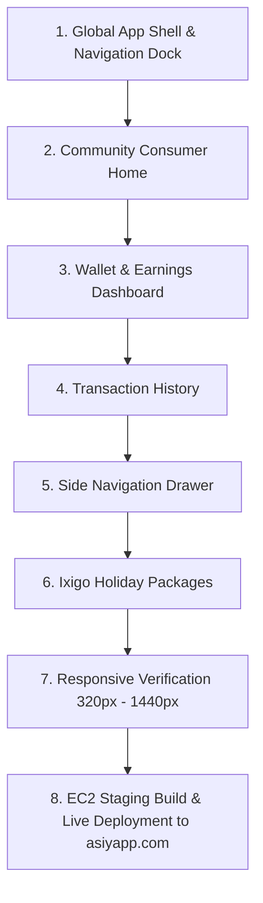

# Screen Migration Plan & Execution Order
**Project**: Trikonekt (asiyapp.com)  
**Strict Mandate**: 100% Presentation Redesign. ZERO Business Logic Changes.

---

## Screen Migration Workflow


---

## 1. Screen-by-Screen Migration Plan

### Step 1: Global App Shell & Bottom Navigation
- **Files**: `src/components/common/AppHeader.jsx`, `src/components/common/BottomNav.jsx`, `src/components/common/AppShell.jsx`
- **Existing Elements**: Standard navigation dock, basic header.
- **Revamp Objectives**:
  - Implement mobile header with Avatar initials, status indicator, notifications bell with count, and cart count badge.
  - Implement 5-pillar Bottom Navigation dock (`Home`, `Community`, `Packages`, `Wallet`, `Menu`) with frosted glass blur (`16px`) and active pill indicator.
  - Fix iOS / Android safe-area-inset padding to guarantee zero content clipping.

### Step 2: Community Consumer Home
- **Files**: `src/pages/team/TeamDashboard.jsx` (and referenced in `UserDashboard.jsx`)
- **Existing Elements**: Top greeting, SPP Cadence widget, Unclaimed gift card alert, Daily wishing banner, Top achievers horizontal scroller, Travel holiday showcase.
- **Revamp Objectives**:
  - Refactor User Profile Greeting into a clean, modern consumer greeting (`Hello, Baburaj 👋 | Community Consumer`).
  - Upgrade Daily Wishing Banner into an editorial, glossy hero showcase with ambient backdrop blur, responsive aspect ratio, and dynamic indicator dots.
  - Implement quick-search input with integrated filter action button (`Search destinations (e.g. Munnar, Vaishno Devi)`).
  - Transform categories into vibrant glossy pill badges (`All Packages`, `Sacred Journeys`, `Gift for Parents`, `Family Vacations`).
  - Upgrade SPP Cadence Widget and P2P Gift Card Alert with high-contrast gradient cards and animated progress bars.
  - Upgrade Top Achievers scroller with gold/cyan avatar borders and performance tags.

### Step 3: Wallet & Earnings
- **Files**: `src/screens/TeamWallet.jsx`, `src/pages/Wallet.jsx`
- **Existing Elements**: Main wallet balance, withdrawable balance, action buttons (Move to Pockets, E-Edu, Withdraw), today's earnings, yesterday's earnings, earnings breakdown by tier/pool.
- **Revamp Objectives**:
  - Replace disjointed wallet panels with the signature **Glossy Main Wallet Card**:
    - Deep royal blue-to-cobalt gradient (`#033B76` to `#0099FF`).
    - Prominent balance typography: `₹ 50.25` with eye icon toggle.
    - Quick actions strip: **Move to Pockets** (Emerald), **E-Edu Academy** (Cobalt), **Withdraw** (Orange).
  - Implement today's and yesterday's earnings mini-cards with percentage growth tags (`+ 100%`).
  - Render Withdrawable Pocket and Self Account Balance cards with distinctive colored icons.
  - Format **Earnings Breakdown** into clean 2-column cards (`Package Direct`, `Layer 5 & 3 Blocks`).
  - Embed the **Recent Transactions** preview snippet directly inside the wallet view.

### Step 4: Transaction History
- **Files**: `src/pages/History.jsx`
- **Existing Elements**: 8-category tabs, search & filters, counterparty phone masking, timestamp parsing, transaction classification.
- **Revamp Objectives**:
  - Implement sticky category filter pills (`All`, `Main Wallet`, `Self Account`, `Packages`).
  - Transform transaction rows into high-speed scanning items:
    - Left-hand direction bubble (Green circular arrow for credit, Red for debit).
    - Bold primary title (`5 Blocks - Layer 1`, `SPP Personal Cashback`, `Withdrawal Request`).
    - Secondary ledger context (`Main Wallet Credit`, `Self Account Credit`, `Package Debit`).
    - Masked user reference (`From 8095****105`) and transaction time (`12:16`).
    - Right-hand monetary badge (`+ ₹9.00`, `+ ₹12.50`, `- ₹500.00`).
  - Group transactions chronologically with high-contrast date header chips (`Today • 04 Oct 2026`, `03 Oct 2026`).

### Step 5: Side Navigation Drawer
- **Files**: `src/components/common/AppDrawer.jsx`
- **Existing Elements**: Menu drawer with links to Academy, Invoices, SPP, Holidays, Layers Blocks, History, Profile, Support, Logout.
- **Revamp Objectives**:
  - Implement the luxury dark gradient header (`linear-gradient(135deg, #091E3A 0%, #103766 100%)`).
  - Prominent user profile badge with initials, username/phone, and active status (`✓ Agent`).
  - Segment menu into clear uppercase group headers (`PACKAGES`, `NETWORK & FINANCE`, `SETTINGS`).
  - Enrich every menu item with a tailored icon, subtle pill hover/active state, and right-chevron indicator.
  - Implement vibrant red glossy **Logout** button with prominent icon and confirmation handler.

### Step 6: Travel & Holiday Packages
- **Files**: `src/components/travel/IxigoHolidaySection.jsx`
- **Existing Elements**: Curated Munnar, Vaishnodevi, Kamakhya, Rajasthan, Odisha, Goa, Thailand holiday packages, search filter, category filter chips, booking modal.
- **Revamp Objectives**:
  - Restyle package cards to mirror luxury travel commerce applications:
    - Cinematic photo cards with badge overlays (`GIFT FOR PARENTS`, `2N / 3D`, wishlist heart).
    - Inclusion pills (`Cab`, `Hotel`, `Meals`, `Sightseeing`).
    - Pricing callout: `₹6,990 onwards` with rating badge `★ 4.8 (120+)` and action button.
  - Elevate package detail modal with itinerary timeline tabs and WhatsApp booking trigger.

---

## 2. Responsive Viewport Verification Matrix

| Viewport Width | Device Target | Key Checks |
|---|---|---|
| **320px – 360px** | Compact Android (Galaxy A series) | Zero horizontal scrolling. Button text wraps cleanly. Bottom dock icons fit without collision. |
| **375px – 390px** | Standard iPhone (iPhone 12/13/14/15/16) | Native padding margins (16px), safe-area bottom dock offset (78px + safe-area). |
| **414px – 430px** | Large Mobile (iPhone Plus / Pro Max) | Cards scale proportionally; text remains crisp and scannable. |
| **768px – 1024px** | Tablets / iPads | Multi-column grid adapts gracefully (2 columns for cards, balanced scrollers). |
| **1024px – 1440px**| Desktop / Laptops | Centered max-width container (1200px), clean desktop header layout. |

---

## 3. Staging Deployment Protocol (`asiyapp.com`)

1. Compile React production build:
   ```powershell
   cd frontend
   npm run build
   ```
2. Verify build artifacts in `frontend/build`.
3. Package archive:
   ```python
   tar -czf frontend-build.tar.gz build
   ```
4. SCP upload to EC2 staging server (`65.0.40.184` via `TRI_MARKETING.pem`):
   ```bash
   scp -i "C:\Users\babur\Downloads\TRI_MARKETING.pem" -o StrictHostKeyChecking=no frontend-build.tar.gz ubuntu@65.0.40.184:/tmp/
   ```
5. Extract and reload Nginx:
   ```bash
   sudo cp -r /tmp/build/* /srv/trikonekt/staging/frontend/build/
   sudo chown -R www-data:www-data /srv/trikonekt/staging/frontend/build
   sudo systemctl reload nginx
   ```
6. Verify live deployment at `https://asiyapp.com/`.
