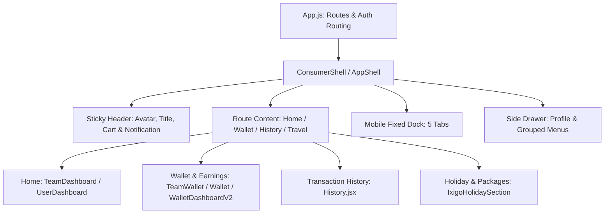

# UI Revamp & Modernization Deep Analysis
**Application**: Trikonekt (asiyapp.com)  
**Scope**: Consumer & Community Mobile-First Platform UI Revamp  
**Target Environment**: EC2 Staging (`asiyapp.com` / `65.0.40.184` at `/srv/trikonekt/staging/frontend/build`)  
**Strict Rule**: **ZERO Business Logic Changes | Presentation Only**

---

## 1. Executive Summary & Existing Architecture

The existing frontend application is a **React 18.2 SPA** bootstrapped with `react-scripts 5.0.1`, utilizing:
- **Material UI (`@mui/material` v7.3.4)** with `@emotion/react` & `@emotion/styled`
- **Framer Motion (`framer-motion` v12.23.26)** for physics-based micro-interactions
- **Zustand (`zustand` v5.0.9)** for client-side state (cart, notifications)
- **Axios (`axios` v1.12.2)** with custom interceptors, local caching, token refreshes, and API base URL resolvers
- **React Router DOM (`react-router-dom` v6.30.1)** for client-side page routing
- **Design Tokens**: Basic `src/theme/tokens.js` (colors `C`, spacing `SP`, radius `R`, shadows `S`, typography `T`)

### Architectural Overview

---

## 2. Comprehensive Screen & Component Map

| Screen Name | Current Route(s) | Primary Component(s) | Data Source(s) & Endpoints | Business Logic & Calculations Guarded |
|---|---|---|---|---|
| **Community Consumer Home** | `/user/team-dashboard`, `/user/dashboard`, `/v4/home` | `src/pages/team/TeamDashboard.jsx`, `src/pages/UserDashboard.jsx` | `GET /accounts/profile/` `GET /business/team-consumer/wishing-banners/` `GET /business/team-consumer/top-achievers/` `GET /business/spp/cadence/` `GET /accounts/wallet/vouchers/` `GET /business/tri/apps/tri-holidays/` | SPP 12-box cadence, unredeemed gift voucher detection, user ID & status display, dynamic wishing carousel, achiever highlights, travel package query. |
| **Wallet & Earnings** | `/user/team-wallet`, `/user/wallet`, `/user/wallet-dashboard` | `src/screens/TeamWallet.jsx`, `src/pages/Wallet.jsx`, `src/pages/consumer/WalletDashboardV2.jsx` | `GET /accounts/wallet/me/` `GET /accounts/wallet/me/history/` `GET /mlm/ranks/eligibility/` `POST /accounts/wallet/transfer/` | Main wallet balance (`balance`), Withdrawable Pocket (`withdrawable_balance`), Self Account (`self_account`), 10-level cap limits, 10% TDS deductions, 7-day sequential upgrade countdown, today/yesterday earnings. |
| **Transaction History** | `/user/history`, `/user/team-history` | `src/pages/History.jsx`, `src/pages/team/TeamWalletHistory.jsx` | `GET /accounts/wallet/me/history/` `GET /accounts/wallet/vouchers/` | 8 distinct category filters (All, Main, Self, Packages, Layer, Direct, Royalty, Withdrawals), counterparty phone masking (`8095****105`), credit/debit amount math, timestamp parsing, voucher redemption status. |
| **Side Navigation Drawer** | Slide-out drawer (`trikonekt:open-consumer-sidebar`) | `src/components/common/AppDrawer.jsx` | `localStorage.getItem("user_user")` | Active route highlighting, profile status badge, user phone/ID, logout token clearance, deep links to external Academy and internal modules. |
| **Bottom Navigation Dock** | Bottom fixed bar on mobile viewports (<1024px) | `src/components/common/BottomNav.jsx` | React Router `useLocation()` | 5 Navigation pillars (Home, Community, Packages, Wallet, Menu drawer trigger) with active indicator highlighting. |
| **Travel & Holiday Packages** | `/user/tri/tri-holidays`, `/user/packages/tri-tour` | `src/components/travel/IxigoHolidaySection.jsx` | `GET /business/tri/apps/tri-holidays/` `CURATED_PACKAGES` fallback | Category filters (All, Sacred Journeys, Gift for Parents, Hills, Beach, International), search filter, ₹250 booking token badge, detail view modal, WhatsApp enquiry trigger. |

---

## 3. Existing UX/UI Audit & Problems Identified

### A. Community Consumer Home (`TeamDashboard.jsx` & `UserDashboard.jsx`)
1. **Visual Density & Lack of Editorial Polish**: The hero section currently displays a standard white paper card greeting that feels like a utility dashboard rather than an inspiring consumer platform.
2. **Promotional Banner Treatment**: The wishing banner uses standard aspect ratios that feel disconnected from the overall aesthetic rather than an immersive, glossy editorial hero banner.
3. **Category Tiles & Actions**: Quick action icons lack a unified glossy pill / tile treatment with cohesive depth and micro-animations.
4. **Achievers Section**: Achiever cards appear in a generic scroller without rich tiered visual badging or glossy gradient borders.

### B. Wallet & Earnings (`TeamWallet.jsx` & `Wallet.jsx`)
1. **Information Hierarchy**: The main balance (e.g. ₹50.25) is surrounded by multiple disparate cards without a clear hero financial card anchor.
2. **Action Clarity**: Core actions (*Move to Pockets*, *E-Edu Academy*, *Withdraw*) lack bold semantic differentiation (glossy primary emerald/cyan for move, cobalt for academy, amber for withdraw).
3. **Earning Breakdowns**: 5-Blocks, 3-Blocks, SPP cashback, and package direct rewards are scattered across multiple tables instead of a cohesive summary grid with clear percentage and status pills.

### C. Transaction History (`History.jsx`)
1. **Scanning Friction**: Transaction rows currently show dense textual information. A user cannot instantly distinguish between Main Wallet Credit (75%), Self Account Repurchase (25%), and P2P coupons in under two seconds.
2. **Filter Aesthetics**: The 8 transaction filter tabs currently wrap awkwardly on narrower mobile screens (320px–375px).
3. **Timestamp & Date Grouping**: Date groupings ("Today • 04 Oct 2026", "03 Oct 2026") need high-contrast pill markers for effortless financial reconciliation.

### D. Side Navigation (`AppDrawer.jsx`)
1. **Generic Drawer Aesthetic**: Plain white background with standard line items instead of a luxurious dark-to-deep-navy frosted glass header with a radiant user avatar, gold/cyan badge, and clean grouped pill navigation.

---

## 4. Risky & Business-Logic Sensitive Files (DO NOT MODIFY LOGIC)

| File | Sensitive Operations / Calculations | Revamp Guardrail |
|---|---|---|
| `src/api/api.js` | Token authentication, Axios interceptors, baseURL mappings, cache TTL. | **DO NOT TOUCH** API endpoints, query params, or headers. |
| `src/pages/Wallet.jsx` | TDS deductions (10%), OTP transfer flow, minimum ₹100 checks, Python/JS weekday conversion. | Only revamp the visual JSX presentation. Preserve all state handlers and API payloads identically. |
| `src/pages/consumer/WalletDashboardV2.jsx` | 10-level cap formulas, upgrade countdown timer, layer matrix earnings calculation. | Preserve math calculations verbatim (`RANK_TIERS`, `layerMatrixEarned`, `currentLimit`). |
| `src/pages/History.jsx` | Masking logic `maskUsernameMid`, classification `classifyTransaction`, amount formatting. | Keep classification and math routines exactly as defined. Revamp row layout, pills, typography, and icons only. |
| `src/components/common/AppLifecycleSync.jsx` | Auth token validation, storage sync. | **DO NOT TOUCH**. |

---

## 5. Recommended Migration Sequence

1. **Phase 1: Design Tokens & System (`DESIGN_SYSTEM.md`)**
   - Create unified colors, glossy surface tokens, typography scale, pill badges, and layered shadows.
2. **Phase 2: Global App Shell Revamp (`AppShell`, `AppHeader`, `BottomNav`, `AppDrawer`)**
   - Elevate mobile dock navigation and side drawer into glossy, consumer-grade components.
3. **Phase 3: Community Consumer Home Revamp (`TeamDashboard.jsx`)**
   - Implement the glossy editorial hero banner, greeting header, category pills, SPP widget, and curated holiday cards.
4. **Phase 4: Wallet & Earnings Revamp (`Wallet.jsx` & `TeamWallet.jsx`)**
   - Upgrade to a deep-blue/cyan glossy main balance card, instant action buttons, and segmented earnings grid.
5. **Phase 5: Transaction History Revamp (`History.jsx`)**
   - Upgrade transaction rows with 2-second scan visual hierarchy, dual-wallet credit badges, and sleek date separators.
6. **Phase 6: Travel Packages Showcase (`IxigoHolidaySection.jsx`)**
   - Elevate travel cards with high-contrast imagery, verified badges, amenity pills, and sticky booking CTAs.
7. **Phase 7: Responsive QA (320px – 1440px) & Build Verification**
   - Validate on all target viewports without horizontal scrolling or clipped cards.
8. **Phase 8: EC2 Staging Deployment to `asiyapp.com`**
   - Build production bundle, package, upload via `TRI_MARKETING.pem` to `65.0.40.184`, extract to `/srv/trikonekt/staging/frontend/build`, and reload Nginx.
